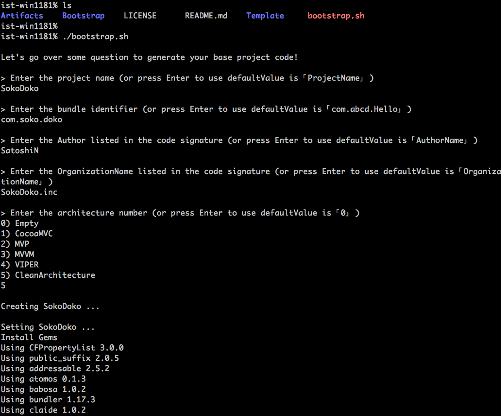

iOS-Architecture-Template
===


## TODO
- [x] Empty Template
- [ ] CocoaMVC Template
- [x] MVP Template
- [ ] MVVM Template
- [ ] VIPER Template
- [x] CleanArchitecture

## Usage

git clone: 

```shell
git clone git@github.com:SatoshiN303/iOS-Architecture-Template.git
```

Run `bootstrap.sh` script: 

```shell
./bootstrap.sh
```

Answer some questions:



Now start coding your app!! 🥂

## LICENCE
